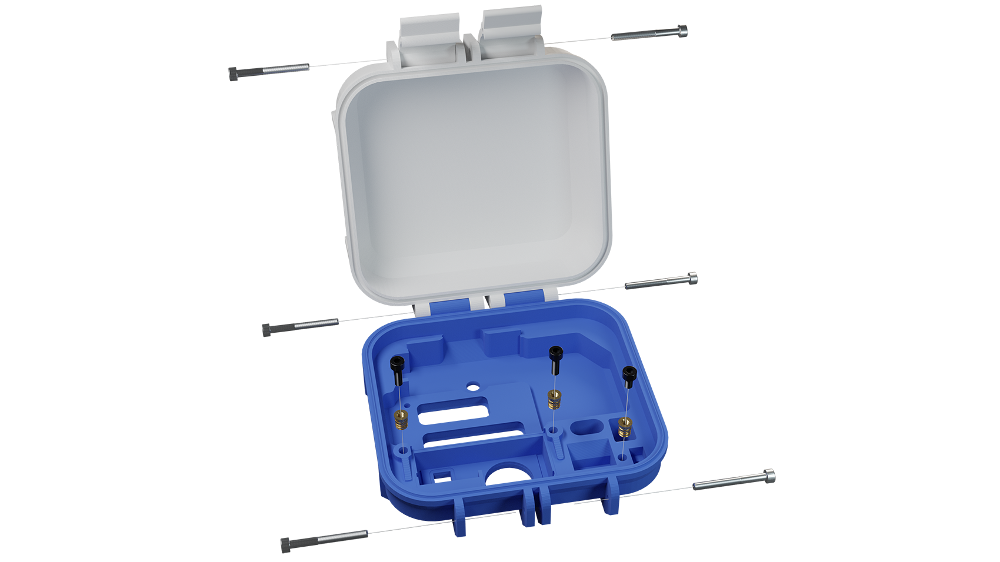
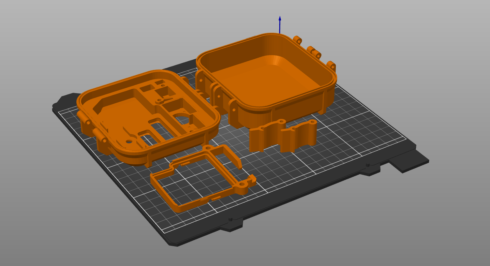
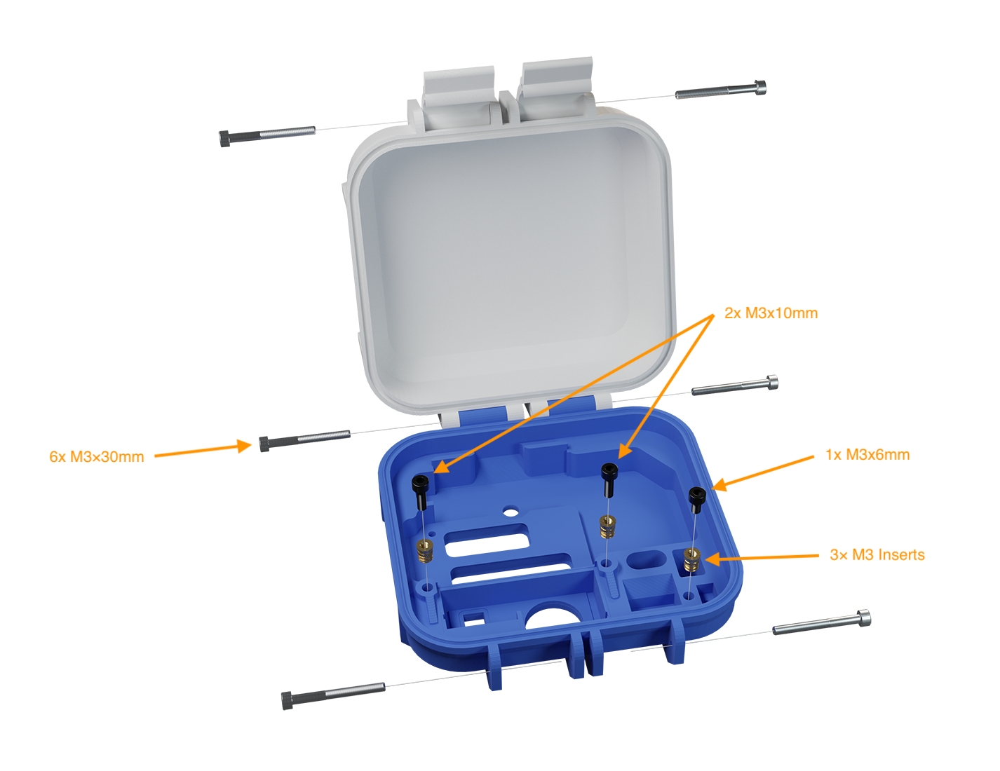

# SCK 2.2 3D printed

This enclosure is to be used with the SCK 2.2. It's based on the [Frog Box design](https://www.thingiverse.com/thing:4582978), with additional modifications, remade from scratch in [Blender]([url](https://www.blender.org/)).

⚠️ WARNING: This enclosure is to be used in indoor spaces. The sensors are not fully protected from moisture in this design.

To use it, you need to print:

- 1x [cover](components/cover.stl)
- 1x [base](components/base.stl)
- 1x [clip](components/clip.stl)
- 2x [latches](components/latch_hinge.stl)

## Printing 

We have tested this on a Prusa MK3 3D printer, using PLA and the following settings:

- No supports
- 0.2mm layer height
- At least 3 vertical walls
- We recommend to avoid using gyroid as an infill

See the slicer capture below:

## Additional components

- 3x M3 Inserts
- 6x M3x30mm INOX screws
- 2x M3x10mm screws
- 1x M3x6mm screw
- One external [SC reset button](https://github.com/fablabbcn/smartcitizen-enclosures/tree/master/SmartCitizen%20Power%20Options/Reset%20button)
- Rubber seal 2.5mm

