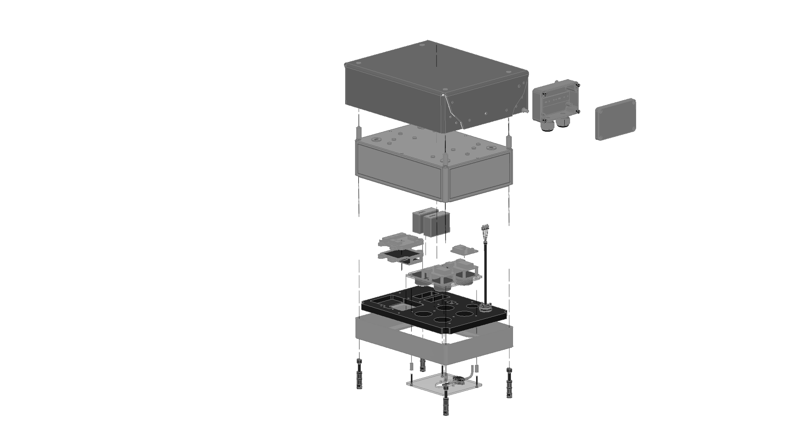

# Station Rev 3.0 4-EC-2PM

This are the hardware design files for a Station Rev3.0 with 4 electrochemical sensors and 2PMS5003.

Components are in the [components](components) folder:

- [3DPRINTING](compontents/3DPRINTING) for parts to be 3D printed to hold components in
- [AUXLIARIES](compontents/AUXLIARIES) for elements such as the reset button
- [LASERCUT](compontents/LASERCUT) laser cut acrylic components