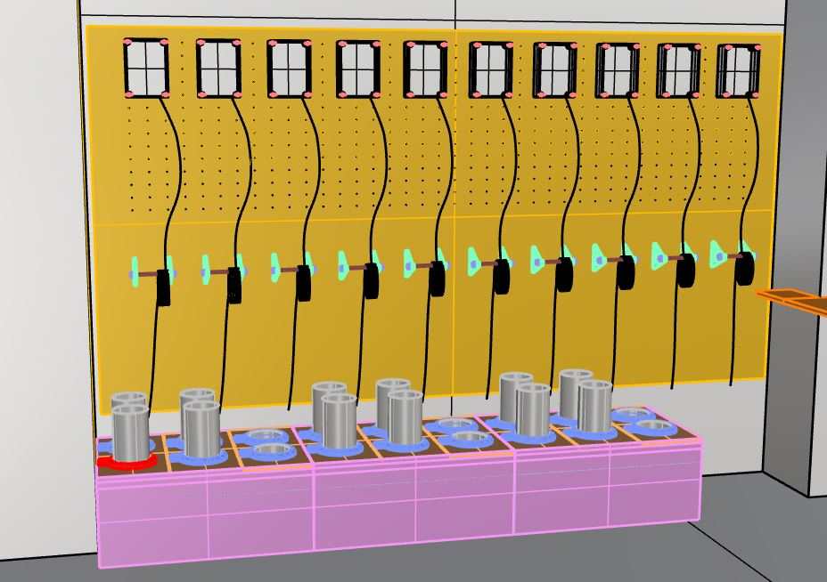
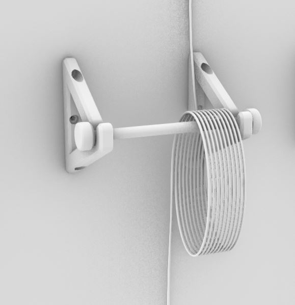
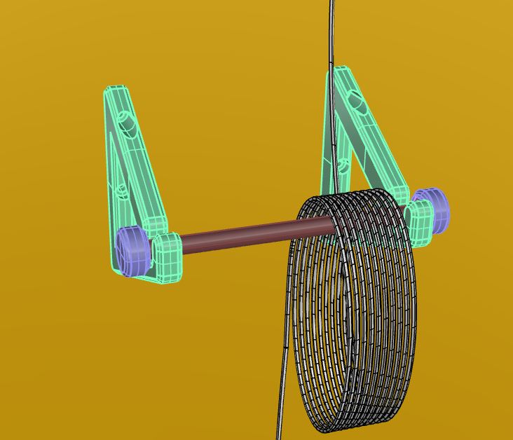
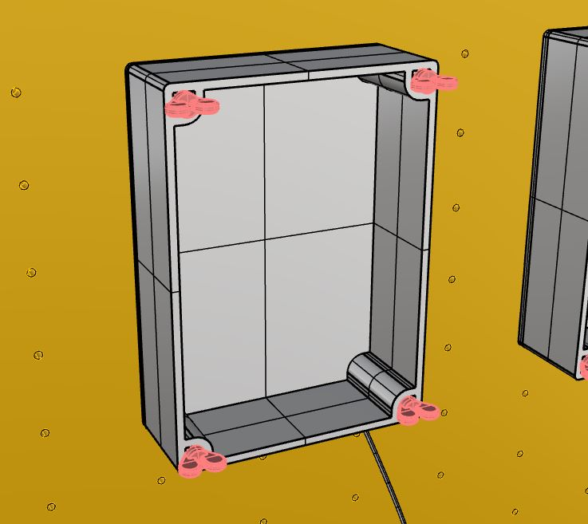
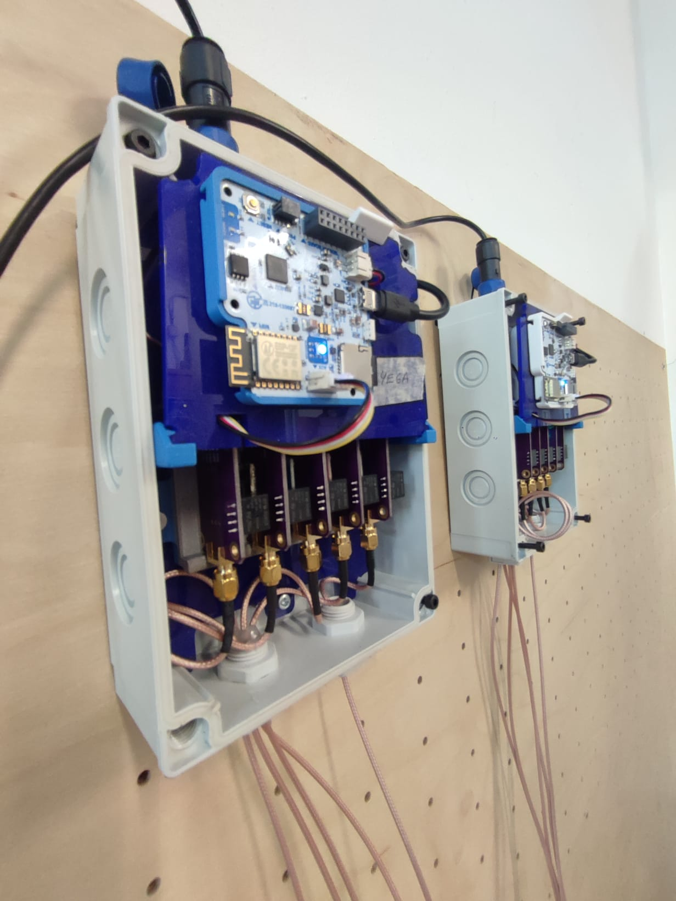
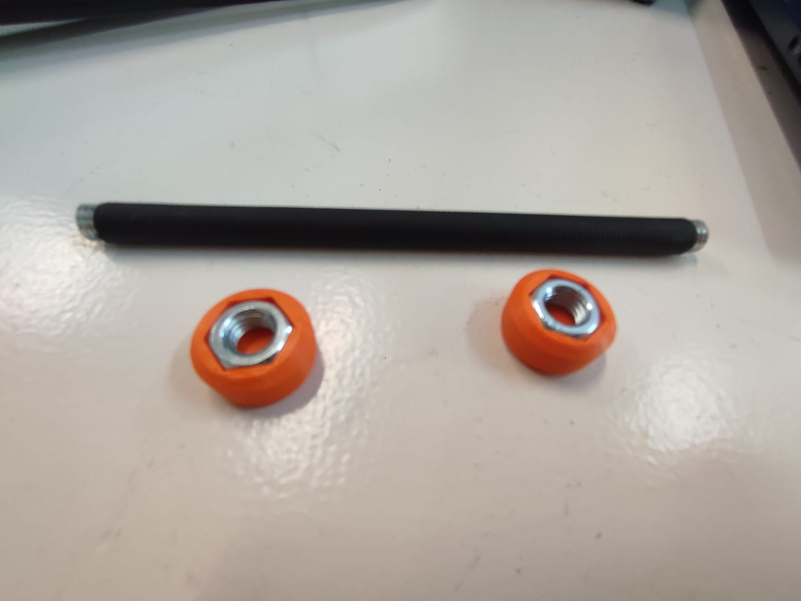
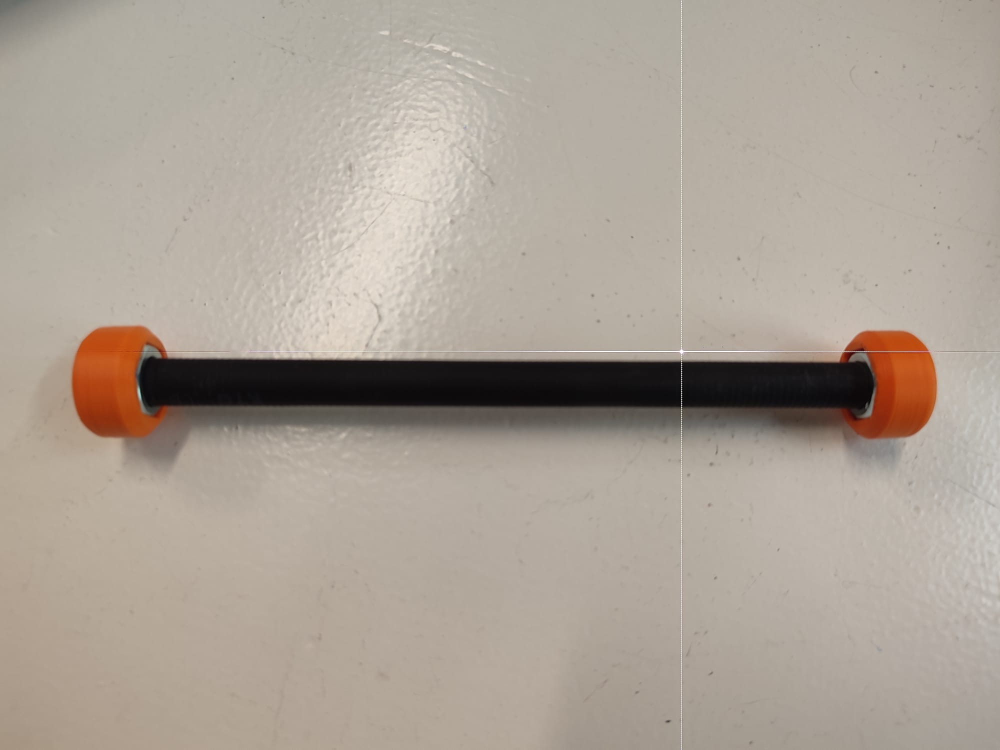
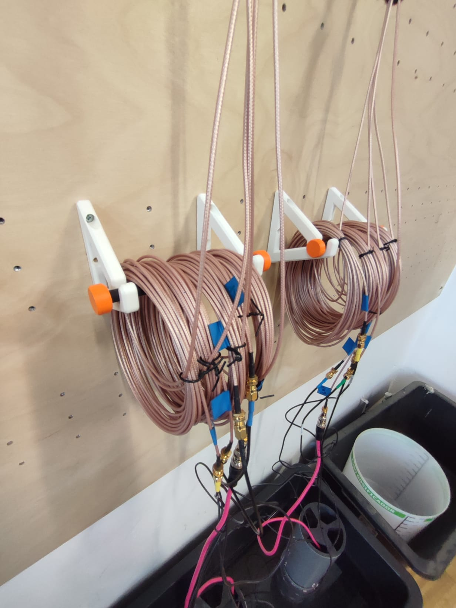

# Water Wall 

A wall to hold and organize the "Testing Units". Made out of wood, with metal inserts on the back to host screws so the units are tightly fixed and they don't fall by mistake. A cable holder for the sensor cables and a water bucket to dip the sensors to be tested.

## Materials
- **Wood panel 2440x1220x9mm** --> As a board to hang all the sensors. With Metal inserts in the back.
- **M4 x 60 Screws** --> Together with a 3d printed wing head for the screw "IP_Box_WingHead_v3.stl" sticked with a drop of glue, so it is easier to screw the Ip boxes of the testing units to the wall.
- **Metal Inserts**  --> Placed into the back of the wood board, to host the Ip boxes screws.
- **M8 Threadded bar** --> Cutted at 140 mm lenght to fit the 3d printed "Cable_Holder_v1.stl".
- **M8 screw Nuts** --> To cover the ends of the thredded bar of the "Cable holder" together with the 3D print "Cable_Holder_Metal_Nut_Cover.stl" to cover the nut.
- **Heatsink tube** --> To cover the threadded bar so its soft and doesn't scratch the sensor cables.
- **Bucket for water** --> Anything around 65L and 65x44x28cm.

## Images

 

 
 
 
