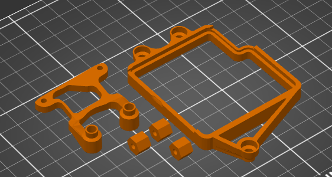
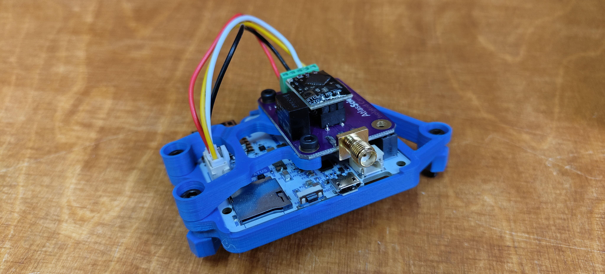

# Smart Citizen Water Kit

The Smartcitizen water kit is mounted inside a commercial [IP BOX](https://es.rs-online.com/web/p/cajas-de-uso-general/2663546) to make sure that the enclosure is protected outdoors. This enclosure is very simple, it only contains three 3D-printed models that are easy to print, no supports are needed in any of the pieces.

## Printing Settings

This enclosure is very simple, it only contains three 3D-printed models that are easy to print, no supports are needed for any of the pieces. Watch carefully the orientation of the objects when printing to avoid supports. The pieces are normally printed in PLA but could be printed in ASA, PETG or ABS. Everything is printed with a normal 0.4mm nozzle and 0.2mm layer height. We recommend printing with three perimeters to increase strength.

### CLIP

In this enclosure, a custom clip is needed to adapt the position of the screws to the [IP BOX](https://es.rs-online.com/web/p/cajas-de-uso-general/2663546).

### Carrier Holder

The carrier is held in place with two screws. When the carrier and its holder are together, the whole piece can be screwed into the box using the same two screws used for the CLIP.stl.

### SEP

These small separators need to be placed between the CLIP.stl and the box to have a gap to place the battery.

## BOM

* [IP BOX](https://es.rs-online.com/web/p/cajas-de-uso-general/2663546).
* 2x M3 x 6mm screw.
* 2x M3 x 20mm screw.
* 1x M3 x 15mm screw.
* 1x [Fixed Terminal Blocks 5P 2.54mm 90DEG](https://www.mouser.es/ProductDetail/Phoenix-Contact/1725685?qs=A%2FKWGUWTCZiuYWt6zAMYZA%3D%3D).
* 1x Grove-Universal 4Pin buckled 15cm cable.
* 1x SPLIT CABLE GLAND QVT 16 wo grommet.
* ICOTEK GROMMET w/ two holes.
