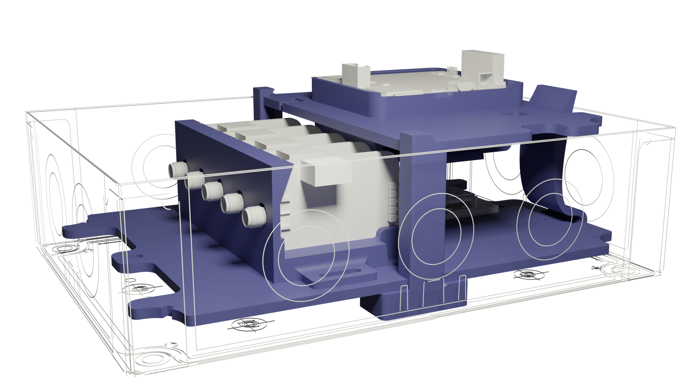
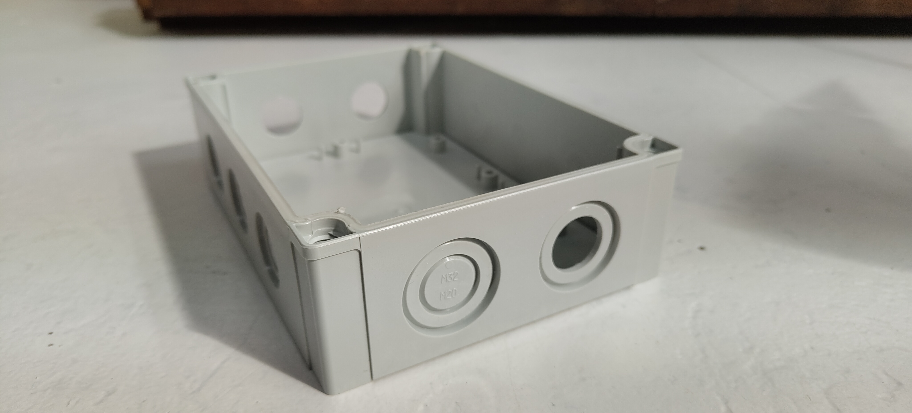
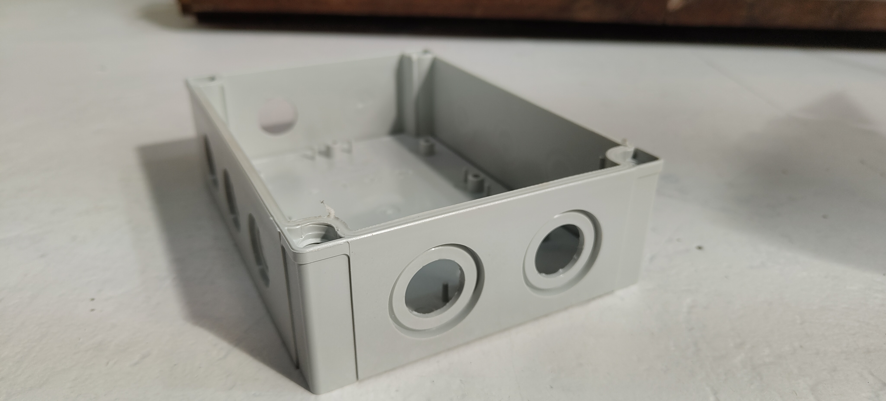
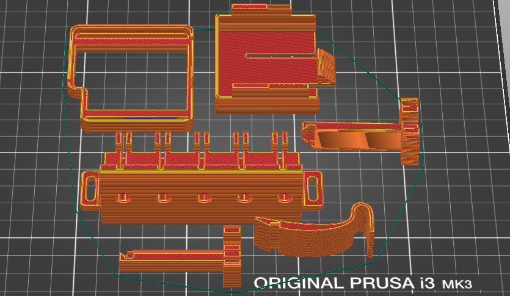

This Enclosure is build inside a comercial polycarbonate [IP box](https://es.rs-online.com/web/p/cajas-de-uso-general/4985129) the enclosure is not waterproof, is recomended enclosure this box in to a bigger one to avoid having problems with rain. 

The box needs some modifications, holes are needed for power and data cables. 16mm holes have to be done, to do this holes we use a [step drill bit](https://sg.rs-online.com/web/p/specialist-drill-bits/1238509)

## Printing Settings

The prints are done with PLA but there is no issue in unsing diferent materials like ASA, PETG or ABS. Everything is printed with normal 0.4mm nozzle and 0.2mm layer height. We recomend to print with 3 perimeters to increasse strenghth.

### CLIP

The SCK is hold in place with the Clip, this one has two slots which fit in the battery holder.

### Battery holder

The battery holder is a small box where th battery can be hold. The battery holder and the clip are joined together with the top acrylic in between. The cable of the battery can pas trough a hole in the acrylic and be connected to the SCK.

### Carriers holder

This piece holds in place the carrier boards. Make sure the boards are in place pressing untill until the plate "clicks in" and stays in the correct position.

### Clamp acrylic

This piece acts as a spring to hols the acrylic on position.

### Columns top acrylic

Two more Columns are needed to hols the acrylic that holds the SCK and the battery.

## Laser cutted acrylics

All is mounted in two diferent acrylic 4mm sheets which have been cutted using a laser. 

To assembly the station can be done outside the box mounting the 3D printed parts on to the acrylics and then screw this ones to the [IP Box](https://es.rs-online.com/web/p/cajas-de-uso-general/4985129) 

## BOM

* 4x self-tapping screws for plastic (soft materials) - [we use this one](https://www.celofixings.es/tornillos-rosca-plasticos/2834-tornillo-rosca-plastico-cl81z-celoplast-cabeza-alomada-pz.html?ref=4112CL81Z&attr=3861)
* 1x M3 screw and nut to hold the "Clamp acrylic" pice 
* 6x M2.5 nylon scews and nylon nuts to hold in place the power manageent board and the holder for the Carrier boards.
* [Nylon spacers](https://es.rs-online.com/web/p/aislantes-para-tornillos/0178658).
* Internal bulgin usb connector.
* 2x SPLIT CABLE GLAND QVT 16 wo grommet.
* ICOTEK GROMMET w/ four holes.
* ICOTEK GROMMET w/ one hole.