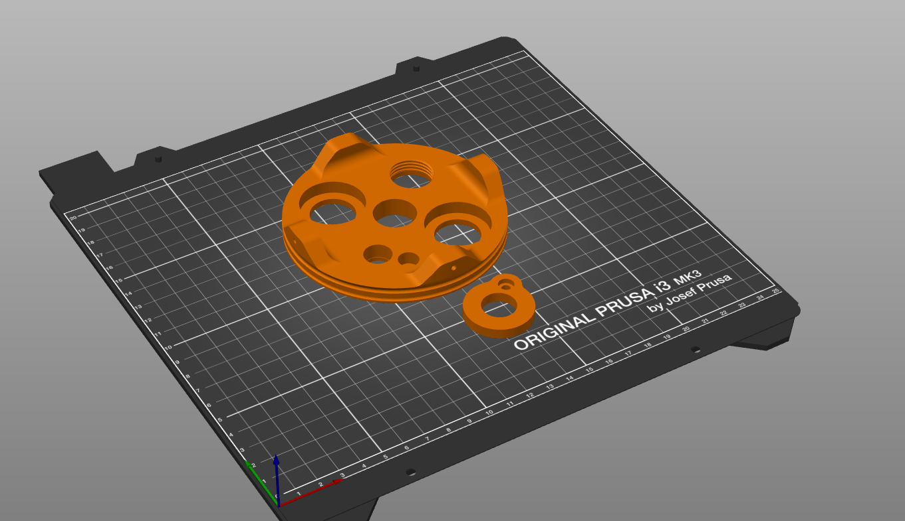

# BULK

This is a holder for the Atlas Scientific Probes that fits inside a PVC pipe (110mm OD), that can be used to deploy the probes underwater in a low budget. The components are 3D printable, so they need to be printed with a material that can resist in water (or worse, seawater). The proposed material for it is ASA, but other materials might work better.

## Components

There are two pieces: a disk that will hold the probes, and a small additional retainer for the dissolved oxygen (DO) probe, which is too short to be held like the other probes.

The number of probes can change (maximum 4 in this design - if you have more, you can modify the step file). There is one that has a threaded part for fitting a thermowell for the temperature sensor. 

The long probes (pH, EC, ORP) are to be held with a normal cablegland (PG13.5 or M20 would work). In the case of the DO probe, you need a M4 stainless steel screw  (A4 for seawater) and a nut (we use a safety nut with nylon retainer).

Finally, the disk is attached to the pipe with self-tapping stainless steel screws (A4 for seawater) like [these ones](https://es.rs-online.com/web/p/tornillos-autorroscantes/5221325).

## Printing

This is how the piece should be printed. Make sure that you select `Detect thin walls` and `Detect Bridges` in your slicing program.

